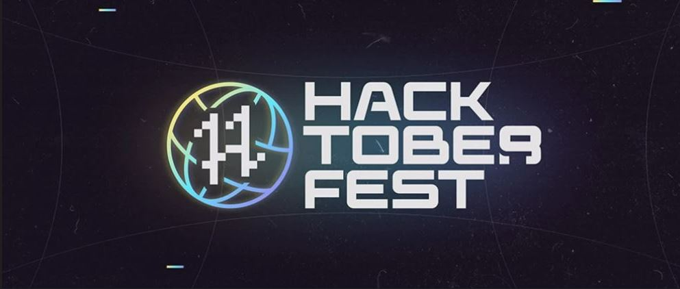

# DSA-Problems

## Hacktoberfest-2022🔥



Feel free to use this project to make your first contribution to an open-source project on GitHub.

## Guidelines

- Contribute a DSA Problem.
- The Program should be executable, with 0 errors and proper documentation.
- Do not add a code if it exists already.
- Explain your code with the help of comments.
- Filename should follow the order `solution.extension`.
- Example:   `solution.cpp`, `solution.py`.
- Don't spam it will be rejected immediately.

## ✨ Contribution Guidelines
- You can contribute your code in any one language like c, c++, java, python etc.
- Your code should be neat and clean.
- You can add any code but it should not be repeated. To avoid redundancy, check all contributions before.
- Add your code to the relevant folder.
- If the file of any language is not exists already then create it and add your code.
- Do NOT remove other content.
- Try to keep pull requests small to minimize merge conflicts.
- Add algorithms to existing problems
- Add Data Structure programs in any language
- Find bugs in the code.

## Steps For Contribution

0. Star <a href="https://github.com/gdscjec/dsa-problems" title="this">this</a> repository.

1. Fork <a href="https://github.com/gdscjec/dsa-problems" title="this">this</a> repository.

2. Clone the forked repository.

```bash
git clone https://github.com/<your-github-username>/dsa-problems
```

3. Navigate to the project directory.

```bash
cd dsa-problems
```

4. Create a new branch.

```bash
git checkout -b <your_branch_name>
```

5. Make changes.

6. Add your name and username to the [List of contributer](contributers/README.md).<br>

```md
- [Your Name] | [Github username]
```

7. Stage your changes and commit

```bash
git add -A

git commit -m "<your_commit_message>"
```

8. Push your local commits to the remote repo.

```bash
git push -u origin <your_branch_name>
```

9. Create a Pull Request.

10. Congratulations! 🎉 you've made your contribution.

---
